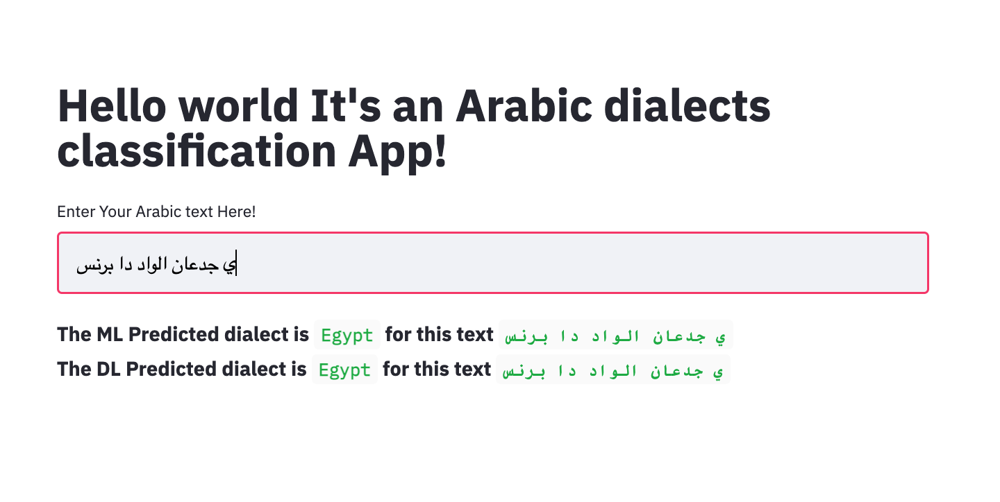

# Arabic-Dialect-Identification
Muliclass classification for Arabic dialect

### This repo consistes of:
* 1- Araabic dialect data and fetching data notebook
* 2- Data pre-processing and modeling approches, which is Machine Learning and also Deep Learning.
* 3- Deployment by Heroku.

#### Note:
The data and pre-trained models it quite large so you can run the notbook and get the ML and DL loaded file, afteword you can add the in the file number "3 Deployment", and you can change the path of your saved models.

If you want deploy the modeling localy you can download it and run it by the following:
  * a. Install the requirment text file in your environment.
  * b. Run this line of code to open a local host with pretty page that takes an input Arabic text and predict which dialect belong.
    `streamlit run app.py`

### This image show the predicted dialect by given text.

